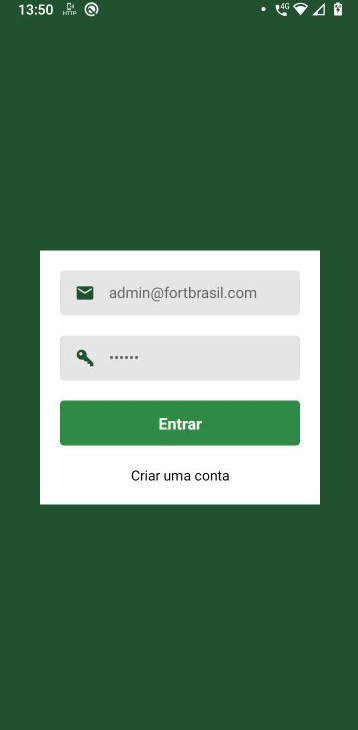

<h1 align="center">
  
  <br>
  Ajudando pessoas a viverem melhor
</h1>

<p align="center">
  &nbsp;&nbsp;&nbsp;&nbsp;
  &nbsp;&nbsp;&nbsp;&nbsp;
  
</a>

<p align="center">
  <a href="#rocket-sobre">Sobre</a>&nbsp;&nbsp;&nbsp;|&nbsp;&nbsp;&nbsp;
  <a href="#camera-preview">Preview</a>&nbsp;&nbsp;&nbsp;|&nbsp;&nbsp;&nbsp;
  <a href="#computer-como-usar">Como usar</a>&nbsp;&nbsp;&nbsp;
</p>

## :rocket: Sobre
Este projeto de um teste pratico para um gerenciamento de lojas mais proximas do cliente.

Esta é a 3/3 partes de um projeto como todo. O mesmo foi construído utilizando as tecnlologias mais populares de JavaScript e do mercado.

Se você ainda não baixou as partes (1/3) ou (2/3), você vai encontrar elas abaixo, siga os passos para uma instalação correta:
- [(1/3) Api](https://github.com/Demontie/fortbrasil-backend)
- [(2/3) Web](https://github.com/Demontie/fortbrasil-frontend)

## :camera: Preview
<p align="center">
  
</p>

## :computer: Como usar
### :rotating_light: Importante!
Para o maps carregar normalmente vá até
a pasta 'android\app\src\main\AndroidManifest.xml' exatamente na linha 30.

android:value=<KEY_API_GOOGLE_MAPS>

Substitua pela sua chave do google maps.

Nãoesqueceça de habilitar a gps do seu dispositivo.

### Instalação

```bash
# Clonar repositório
$ git clone https://github.com/Demontie/fortbrasil-mobile.git

# Pasta do clone
$ cd fortbrasil-mobile

# Instalar dependências
$ yarn install

# Execute a aplicação
$ yarn start
$ yarn android

# Se ocorrer algum erro com o comando yarn android certifique-se de dar permissão ao gradlew
$ chmod +x ./android/gradlew
```
## :rotating_light: Aviso
A aplicação foi testada na plataforma android.